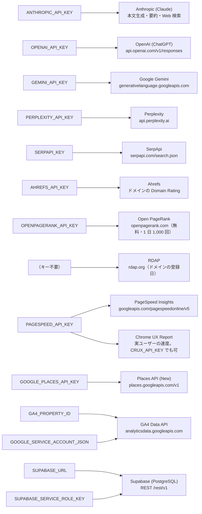
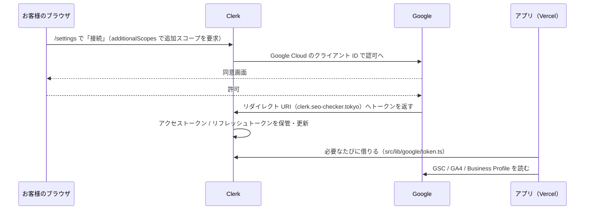
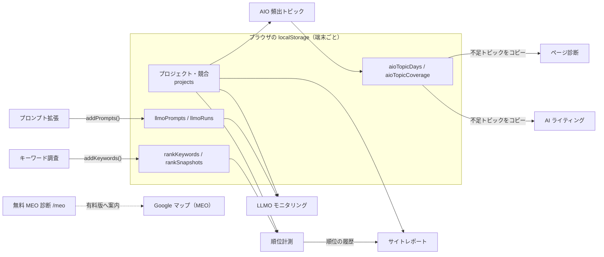
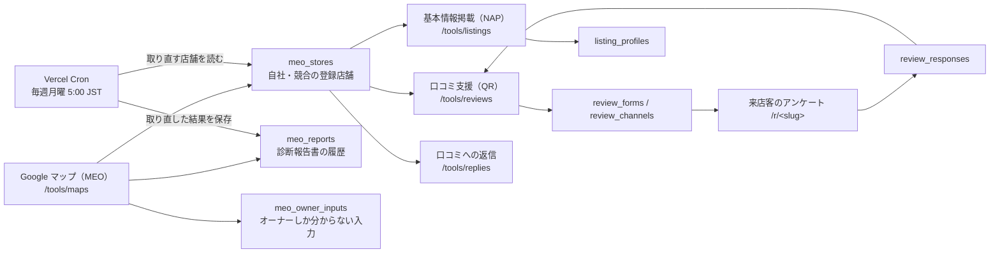

# ツールと API キーの関係図

**どのツール（画面）が、どの外部 API に、どのキーでつながっているか**を 1 か所にまとめた図。
「このキーを入れると何が動くか」「このキーが切れると何が止まるか」をここで引く。

最終更新: 2026-09-16（精密診断の統合、ドメインパワー、数字の診断、料金 3 段階を反映）。

- サービス全体の構成（GitHub / Vercel / Cloudflare / Clerk / Supabase / Google Cloud）→ [services.md](./services.md)
- ルーティングと機能の一覧 → [ARCHITECTURE.md](./ARCHITECTURE.md)
- **数字の出し方（配点・閾値・計算式）** → [scoring-reference.md](./scoring-reference.md)
- いま何が設定済みかという**現在の状態** → [OPERATIONS.md](./OPERATIONS.md)

定義の正本はコード側にある。この図とずれたらコードが正しい。

| 内容 | ファイル |
|---|---|
| 連携の一覧・環境変数名・説明 | `src/lib/features/integrations.ts` |
| キーが設定済みかの判定（値は返さない） | `src/lib/integrations.ts` → `GET /api/integrations` |
| ツールごとの必須 / 任意の依存 | `src/lib/features/registry.ts`（`requires` / `requiresAny` / `optional`） |

---

## 1. つながりは 3 種類ある

同じ「連携」でも、鍵の持ち主と実費の出どころが違う。混ぜて考えると障害の切り分けを間違える。

```
① サーバーのキー（全ユーザー共通）
   Vercel の環境変数 ──→ 外部 API
   運営者が契約し、実費も運営者が払う。ブラウザには渡らない。
   Anthropic / OpenAI / Gemini / Perplexity / SerpApi / PageSpeed / Places / GA4(サービスアカウント) / Supabase

② 利用者ごとの許可（OAuth。鍵は Clerk が預かる）
   お客様が「接続」を押す ──→ Clerk が短命トークンを保管 ──→ アプリが借りて読む
   見えるのは「そのお客様のデータ」。アプリはトークンを保存しない。
   Search Console / GA4(利用者の選択) / Google ビジネス プロフィール

③ ブラウザの中のデータ（キー不要）
   localStorage（seo-checker:v1:*）──→ 別のツールがそのまま読む
   プロジェクト・キーワード・プロンプト・計測履歴。端末の外には出ない。
```

---

## 2. キー → 外部 API（①のつながり）

環境変数がそのまま「連携」になっている（`INTEGRATION_KEYS`）。GA4 と Supabase だけは**2 つ揃って初めて有効**。
RDAP（ドメインの登録日）だけはキーが要らない。



- **キーは 1 本も画面に出さない。**`GET /api/integrations` は `true` / `false` だけを返す（`src/lib/integrations.ts` の冒頭コメント）。
- `NEXT_PUBLIC_` が付く変数だけがブラウザに届く。ここに秘密は入れない。
- モデル名は差し替えられる（キーとは別）: `LLM_MODEL` / `LLM_FAST_MODEL` / `FAQ_MODEL` / `REVIEW_DRAFT_MODEL` / `REVIEW_REPLY_MODEL` / `OPENAI_MODEL` / `GEMINI_MODEL` / `PERPLEXITY_MODEL`。

---

## 3. ツール × キーの対応表

**●** 無いと実行できない ／ **◍** どちらか 1 つあればよい ／ **○** あると機能が増える ／ **−** 不要

| ツール | パス | プラン | ログイン | Anthropic | SerpApi | PSI / CrUX | GA4 | Places | Supabase | 他社 LLM | 利用者の Google |
|---|---|---|:-:|:-:|:-:|:-:|:-:|:-:|:-:|:-:|:-:|
| クイック診断（サイト） | `/` | 無料 | 不要 | ○ | − | − | − | − | − | − | − |
| クイック診断（店舗） | `/meo` | 無料 | 不要 | − | − | − | − | ● | − | − | − |
| **精密診断** | `/tools/seo-analysis` | standard | 必須 | ● | ○ | ○ | − | − | ● | ○ ※6 | ○ GSC / GA4 ※7 |
| サイト診断 | `/tools/site-audit` | light | 必須 | − | − | − | − | − | − | − | − |
| ページ最適化レポート | `/tools/page-report` | light | 必須 | − | − | ○ | − | − | − | − | − |
| ページ診断（競合比較） | `/tools/page-diagnosis` | light | 必須 | ◍ | ◍ | − | − | − | − | − | − |
| AIO 頻出トピック | `/tools/aio-topics` | light | 必須 | ● | ● | − | − | − | − | − | − |
| HP 改修提案 | `/tools/improvement` | standard | 必須 | ● | − | − | − | − | − | − | − |
| 順位計測・AIO 引用 | `/tools/rank` | light | 必須 | − | ● | − | − | − | − | − | − |
| 検索パフォーマンス | `/tools/search-performance` | light | 必須 | − | − | − | − | − | − | − | ● GSC |
| Google マップ（MEO） | `/tools/maps` | light | 必須 | ○ ※1 | − | − | − | ● | ● | − | − |
| 口コミ支援（QR） | `/tools/reviews` | standard | 必須 ※2 | ○ | − | − | − | ○ | ● | − | − |
| LLMO モニタリング | `/tools/llmo` | light | 必須 | ● | − | − | − | − | − | ○ | − |
| プロンプト拡張 | `/tools/prompt-expansion` | light | 必須 | ● | − | − | − | − | − | − | − |
| 生成 AI 流入分析 | `/tools/ai-traffic` | light | 必須 | − | − | − | ● ※3 | − | − | − | ○ GA4 |
| サイトレポート | `/tools/site-report` | light | 必須 | − | ● ※4 | − | ● ※3 | − | − | − | ○ GA4 |
| キーワード調査 | `/tools/keywords` | light | 必須 | ○ | − | − | − | − | − | − | − |
| AI ライティング | `/tools/writing` | standard | 必須 | ● | ○ ※4 | − | − | − | − | − | − |
| 口コミへの返信 | `/tools/replies` | standard | 必須 | ○ | − | − | − | ○ | ○ | − | ◍ BP ※5 |
| 基本情報掲載（NAP） | `/tools/listings` | standard | 必須 | ○ | − | − | − | ○ | ● | − | − |
| llms.txt 生成 | `/tools/llms-txt` | standard | 必須 | − | − | − | − | − | − | − | − |
| 料金プラン・設定 | `/plans` `/settings` | 無料 | 必須 | − | − | − | − | − | − | − | − |

プランは下位互換です（`light` のツールは `standard` / `premium` でも使えます。`PLAN_RANK`: free 0 → light 1 → standard 2 → premium 3）。

- ※1 総評は `ANTHROPIC_API_KEY` があれば AI が執筆し、無ければルール生成の文章になる。registry の `optional` には未記載（[OPERATIONS.md](./OPERATIONS.md) の残タスク #60）。
- ※2 店舗側の管理画面はログイン必須。来店客が QR から開くアンケート `/r/<slug>` と `POST /api/r/<slug>/*` だけは公開（IP ごとの回数制限つき）。
- ※3 GA4 は**利用者が設定画面で選んだプロパティ（②のトークン）が優先**され、無ければ環境変数のサービスアカウント（①）に落ちる（`src/lib/google/ga4.ts`）。どちらも無ければ使えない。
- ※4 サイトレポートの順位はブラウザの `rankSnapshots`（順位計測ツールが作る）から読む。この画面の API 自体は SerpApi を叩かないので、**SerpApi が必要なのは「順位計測で履歴を作るため」**という間接的な依存。AI ライティングは SerpApi があれば上位 10 件を分析して構成案に反映する。
- ※5 Google ビジネス プロフィール（`business.manage`）を接続すると口コミの全件取得と投稿がこの画面で完結する。未接続でも Places の公開口コミ（最新 5 件）から返信案を作れる。
- ※6 セカンドオピニオン（`OPENAI_API_KEY`）。無ければ Claude だけで報告書は完成する。
- ※7 **連携していなくても報告書は完成する**（URL だけで動くのがこのツールの前提）。連携すると「数字の診断」が 134 ルールまで増える → [scoring-reference.md](./scoring-reference.md) §7。
- ページ診断は SerpApi が無いとき **Claude の Web 検索で上位ページを推定**する（実測の順位ではない旨が画面に出る）。
- サイト診断（`/tools/site-audit`）は**精密診断に統合済み**で、サイドバーには出ない（registry の `hidden: true`）。URL は `/tools/seo-analysis` へ転送する。

### 精密診断が 1 回で触る外部 API

1 つの画面が最も多くの API を使うので、内訳を出しておく。

| 呼ぶ先 | キー | 回数の目安 | 実費 |
|---|---|---|---|
| 自前クローラー | − | `SITE_MAX_PAGES` まで | 0 |
| PageSpeed Insights | `PAGESPEED_API_KEY` | 6（トップ + 主要 5 ページ） | 0 |
| CrUX / CrUX History | `PAGESPEED_API_KEY` か `CRUX_API_KEY` | 8 前後 | 0 |
| SerpApi | `SERPAPI_KEY` | 7 前後（キーワード 5 + `site:` + ブランド） | 1 回数円 |
| RDAP | 不要 | 1〜3 | 0 |
| Ahrefs / Open PageRank | `AHREFS_API_KEY` / `OPENPAGERANK_API_KEY` | 1〜3 | 0 |
| Search Console | 利用者の連携 | 12（当期・前期 × 6 次元） | 0 |
| GA4 Data API | 利用者の連携 | 10 | 0 |
| Anthropic | `ANTHROPIC_API_KEY` | 1〜4（やり直し含む） | 数十〜数百円 |
| OpenAI | `OPENAI_API_KEY` | 0〜1（任意） | 数十円 |

キーが未設定のツールは、**必要な環境変数名を出して実行操作だけを無効化する**。ダミーデータで動いているように見せない（`SetupNotice`）。

---

## 4. 利用者ごとの Google 連携（②のつながり）

Anthropic や SerpApi は「運営者のキー 1 本」で済むが、Search Console / GA4 / ビジネス プロフィールは**お客様のデータ**なので本人の許可が要る。鍵はアプリではなく Clerk が預かる。



| スコープ | 使うツール | いつ要求するか |
|---|---|---|
| `webmasters.readonly` | 検索パフォーマンス | 設定画面の接続で必ず（`REQUIRED_SCOPES`） |
| `analytics.readonly` | 生成 AI 流入分析・サイトレポート | 設定画面の接続で必ず（`REQUIRED_SCOPES`） |
| `business.manage` | 口コミへの返信（取得・投稿） | 返信画面で「権限を追加」を押したときだけ |

- 対象サイト / プロパティの選択は Clerk の `privateMetadata.googleLink`（`src/lib/google/settings.ts`）。
- 前提として Clerk の Google 連携が**独自のクレデンシャル**になっていること。既定の共有クライアント ID では上の 3 スコープを要求できない。

---

## 5. ツール間のデータの受け渡し（③のつながり）

キーは関係なく、**先に使うツールが後のツールの入力を作る**という依存がある。診断や計測の結果はサーバーに保存しない。



Supabase を使う MEO 系だけは、**サーバー側のテーブルで**つながっている（端末をまたいでも残る）。



| テーブル | 作る / 読むツール |
|---|---|
| `meo_stores` | maps が登録。reviews / listings / replies が店舗一覧として読む |
| `meo_reports` | maps と Cron が書く。最新と前回の差分を maps が読む |
| `meo_owner_inputs` | maps（オーナー権限が要る項目の手入力） |
| `review_forms` / `review_channels` | reviews（アンケートと店舗別・経路別の QR） |
| `review_responses` | 来店客の `/r/<slug>` が書き、reviews が読む |
| `listing_profiles` | listings（NAP の正本） |
| `analysis_runs` | 精密診断（入力・事実シート・サイト診断の全結果・AI の出力・セカンドオピニオン。月の回数もこの行数で数える） |

ブラウザ側のデータは設定画面から JSON でエクスポート / インポートできる（`exportAll` / `importAll`）。端末を変えると引き継げないのはこの③だけ。

---

## 6. 自動更新（Cron）と決済

```
Vercel Cron（vercel.json: "0 20 * * 0" = 毎週月曜 5:00 JST）
    │  Authorization: Bearer <CRON_SECRET> を Vercel が自動で付ける
    ↓
GET /api/cron/maps-refresh      ← ログインは無い。CRON_SECRET が未設定なら 503 で何もしない
    ↓  Places で全店舗を取り直す（実費が出る）
Supabase（meo_stores → meo_reports）に保存
```

```
お客様が /plans で購入
    ↓  POST /api/billing/checkout（STRIPE_SECRET_KEY / STRIPE_PRICE_LIGHT / _STANDARD / _PREMIUM）
Stripe の決済画面
    ↓  Webhook（STRIPE_WEBHOOK_SECRET で署名検証）
POST /api/billing/webhook → Clerk の publicMetadata.stripe を更新
    ↓
プラン判定（src/lib/plans/current.ts）: Stripe の契約状態 → publicMetadata.plan → DEFAULT_PLAN
```

決済の実体は Stripe だが、**契約状態は Clerk が持つ**のでアプリ側の DB は要らない。

プランは 3 段階（ライト / スタンダード / プレミアム）。プレミアムは料金画面から買えず、受注時に支払いリンクなどで契約を立てる運用なので、
`STRIPE_PRICE_PREMIUM` は「**買えるか**」ではなく「**読めるか**」のために登録する（`purchasablePlanIds()` と `planForPriceId()` の役割が違う）。

---

## 7. キーが切れたら何が止まるか

| キー | 止まるもの | 動き続けるもの |
|---|---|---|
| `ANTHROPIC_API_KEY` | AIO 頻出トピック・HP 改修提案・プロンプト拡張・AI ライティング・LLMO（Claude が必須） | 無料診断（FAQ だけ消える）・サイト診断（サマリーだけ消える）・キーワード調査（意図分類だけ消える）・maps（総評がルール生成に戻る） |
| `SERPAPI_KEY` | 順位計測・AIO 頻出トピック（→ 履歴が止まるのでサイトレポートの順位も伸びない） | ページ診断は Claude の Web 検索による推定に切り替わる。AI ライティングは上位分析なしで構成案を作る |
| `GOOGLE_PLACES_API_KEY` | 無料 MEO 診断・Google マップ（MEO）・毎週の一斉更新 | listings / replies は登録済みデータの閲覧のみ |
| `SUPABASE_URL` / `SUPABASE_SERVICE_ROLE_KEY` | Google マップ（MEO）・口コミ支援・基本情報掲載・一斉更新 | それ以外すべて |
| `GA4_PROPERTY_ID` + `GOOGLE_SERVICE_ACCOUNT_JSON` | 生成 AI 流入分析・サイトレポート（利用者が GA4 を連携していない場合） | 利用者が連携していれば②で動く |
| `PAGESPEED_API_KEY` | 実ユーザーの速度（CrUX）と、ドメインパワーの「実ユーザーの規模」（配点 10）。PSI 自体は未設定でも低頻度なら取れる | ページ最適化レポート（速度以外の項目はそのまま）・精密診断（速度の節が空になるだけ） |
| `AHREFS_API_KEY` | ドメインパワーの「外部からのリンクの評価」が Open PageRank に落ちる | それ以外すべて |
| `OPENPAGERANK_API_KEY` | 上記も無ければ配点 25 点分が分母から外れる（合計点は残り 75 点分で出る） | それ以外すべて |
| `OPENAI_API_KEY` / `GEMINI_API_KEY` / `PERPLEXITY_API_KEY` | LLMO の対象モデルが Claude だけになる | LLMO 本体 |
| `CRON_SECRET` | 毎週の一斉更新（503 で自分から止まる） | 手動の登録・診断 |
| `CLERK_SECRET_KEY` / `NEXT_PUBLIC_CLERK_PUBLISHABLE_KEY` | ログインと、ログインが要る全ツール | 無料診断 2 本・規約・アンケート `/r/<slug>` |
| `STRIPE_*` | 購入と契約状態の同期 | `publicMetadata.plan` と `DEFAULT_PLAN` による手割り当て |
| （キーではない）利用者の Google 連携が未接続 | 検索パフォーマンス、口コミ返信の全件取得・投稿、**数字の診断の 126 ルール**（D05 だけが「必須データ不足」として出る） | 生成 AI 流入・サイトレポートは①のサービスアカウントに落ちて動く。精密診断の報告書も従来どおり完成する |

実費が出るキーには、キーとは別にガードがある。

| 実費 | ガード |
|---|---|
| Places（詳細取得 1 回 ≒ 4 円） | 無料 MEO 診断は IP ごとの回数制限 + 1 日の全体上限（`FREE_MEO_DAILY_LIMIT` 既定 500 / `FREE_MEO_DAILY_SEARCH_LIMIT` 既定 1,500。`0` で停止）。有料側はログイン必須 |
| SerpApi・各 LLM | ログイン必須 + プラン判定。公開しているのは無料診断の FAQ だけ（同じ URL と本文なら 1 時間キャッシュ） |
| クロール | `SITE_MAX_PAGES`（コードの既定 300・最大 1,000。本番は 100 に設定）。クイック診断だけ `FREE_SITE_MAX_PAGES`（代表 10 ページ）。社内ホストへのアクセスは `ALLOW_PRIVATE_HOSTS=1` のときだけ許す |
| 精密診断（AI + SerpApi） | 利用者ごとに月 `SEO_ANALYSIS_MONTHLY_LIMIT` 回（既定 10。運営者は無制限）。1 回の収集につき AI のやり直しは 3 回まで |
| Cron | `CRON_SECRET`。未設定なら一斉更新そのものを無効化 |

### 切り分けの順番

1. `/settings` の「外部連携」で設定済み / 未設定を見る（= `GET /api/integrations`）。
2. 「設定済みなのに動かない」なら Vercel の環境変数を保存し直して **Redeploy**（環境変数は再デプロイまで反映されない）。
3. Google の①②が絡む画面（生成 AI 流入・サイトレポート）は、**どちらの認証で読んだか**（`source: "user" | "env"`）で切り分ける。
4. MEO 系が全滅なら Supabase、口コミ返信だけなら `business.manage` の権限追加を見る。
