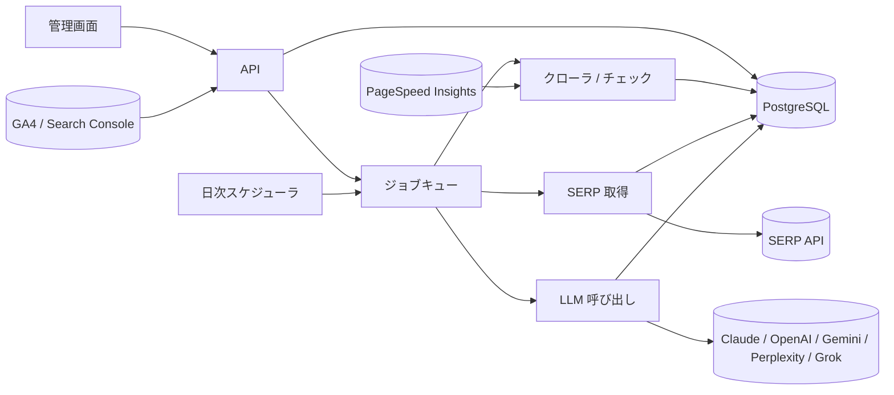
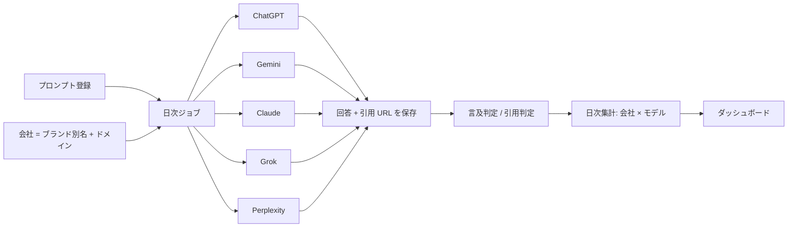

# 実装ガイド: どのように実装するか

[03_feature-catalog.md](./03_feature-catalog.md) の各機能 ID（A1, B3 …）に対応。seo-checker1 は現時点で空リポジトリのため、言語・フレームワークは固定せず、
データモデルは SQL、処理は TypeScript 風の擬似コードで記述している（Python でもそのまま置き換え可能）。
ミエルカ GEO（[06_mieruca-geo.md](./06_mieruca-geo.md)）からの追補は 5.1 / 6.6 / 7.1 節と 15〜19 章。

---

## 0. 前提と全体アーキテクチャ

### 0.1 想定スタック（提案）

| レイヤ | 候補 | 備考 |
|---|---|---|
| Web / API | Next.js（App Router）or FastAPI + React | 管理画面はテーブル・グラフ中心。表示ライブラリは Recharts / Chart.js で十分 |
| DB | PostgreSQL | JSONB で SERP 生データ・LLM 回答を保存。時系列集計は Materialized View |
| ジョブキュー | BullMQ（Redis）/ Celery / Cloud Tasks | クロール・SERP 取得・LLM 呼び出しはすべて非同期ジョブ |
| スケジューラ | cron（毎日固定時刻）/ Cloud Scheduler | 順位計測・LLMO・AIO チェックの日次実行 |
| HTTP 取得 | undici / httpx + Playwright（JS レンダリングが必要な場合のみ） | Chromium はプロジェクトに同梱可 |
| HTML 解析 | cheerio / parse5 / lxml + BeautifulSoup | 本文抽出は Readability 系（@mozilla/readability, trafilatura） |
| LLM | Anthropic Claude（メイン: `claude-opus-5`、大量分類: `claude-haiku-4-5`） | yoriai は Gemini。LLMO モニタリングは各社 API を横断（6 章） |
| PDF 出力 | HTML → Playwright の `page.pdf()` | yoriai のレポートもブラウザ印刷ベース |

### 0.2 共通モジュール（先に作るもの）

```text
core/
  fetcher/        HTTP 取得（UA、タイムアウト、リダイレクト追跡、Content-Encoding 記録、TTFB 計測、robots.txt 判定）
  html/           DOM 化、head 抽出、リンク抽出、見出し・画像・構造化データ抽出
  extractor/      本文抽出（Readability）、文字数、ノイズ率、可読性指標
  checks/         ページ単位のチェックルール（1 ルール = 1 関数、結果は Issue[]）
  serp/           SERP 取得クライアント抽象（プロバイダ差し替え可能、生 JSON 保存）
  llm/            LLM クライアント抽象（構造化出力、バッチ、コスト記録）
  jobs/           キュー定義、進捗、リトライ
  credits/        消費・残高・上限チェック
```



### 0.3 共通データモデル

```sql
create table projects (
  id uuid primary key,
  name text not null,
  domain text not null,             -- 例 example.co.jp（www なし正規形）
  start_url text not null,          -- 例 https://example.co.jp/
  created_at timestamptz default now()
);

create table users (id uuid primary key, email text unique, name text);
create table memberships (
  project_id uuid references projects, user_id uuid references users,
  role text check (role in ('owner','editor','viewer')),   -- viewer = 閲覧専用（yoriai のユーザー追加オプション）
  primary key (project_id, user_id)
);

-- 競合（プロジェクト共通で使う）
create table competitors (
  id uuid primary key, project_id uuid references projects,
  name text, domains text[] not null, brand_aliases text[] default '{}'
);

-- 上限・クレジット（yoriai 方式）
create table plans (
  project_id uuid primary key references projects,
  monthly_credits int default 500, monthly_urls int default 1000,
  keyword_limit int default 100, period_start date
);
create table credit_ledger (
  id bigserial primary key, project_id uuid, feature text, amount int,  -- 消費は負数
  ref_type text, ref_id uuid, created_at timestamptz default now()
);
```

### 0.4 外部データソース一覧

| 用途 | 候補 | 費用感 | 注意 |
|---|---|---|---|
| SERP（順位・Top10・AI Overviews） | SerpApi、DataForSEO SERP API、ValueSERP、Zenserp など | 従量（1 検索 数円〜） | Google の直接スクレイピングは利用規約違反リスクとブロックがあるため外部 API に寄せる。日本（`gl=jp`, `hl=ja`）、デバイス、地域（都市）指定ができるものを選ぶ。AI Overviews のレスポンス（`ai_overview` と参照 URL）を返すかを確認 |
| 検索ボリューム・CPC・12 ヶ月推移 | Google Ads API（Keyword Planner: `GenerateKeywordIdeas` / `GenerateKeywordHistoricalMetrics`）、DataForSEO Keywords Data | Ads API は無料（開発者トークン + 広告アカウント必要） | Ads アカウントに支出がないと丸められた値になる |
| サジェスト | Google のオートコンプリート（`https://www.google.com/complete/search?client=firefox&hl=ja&q=...`） | 無料（非公式） | 高頻度アクセスはブロックされる。キャッシュ必須 |
| 獲得キーワード（他社ドメイン） | DataForSEO Labs `ranked_keywords` / `domain_intersection`、Semrush API、Ahrefs API | 有料 | C2/C3 の本命。自社分は Search Console で代替 |
| 自社の検索パフォーマンス | Search Console API `searchanalytics.query`（query / page / device / country、16 ヶ月分）、URL Inspection API（インデックス状態、1 日 2,000 回/プロパティ） | 無料 | OAuth でプロパティ連携 |
| 表示速度・CWV・a11y | PageSpeed Insights API v5（`strategy=mobile`、`category=PERFORMANCE,ACCESSIBILITY,SEO`） | 無料（API キー、1 日 25,000 回程度） | Lighthouse 結果と CrUX 実測値（LCP / INP / CLS）の両方が返る |
| アクセス解析 | GA4 Data API `runReport` | 無料 | 参照元（`sessionSource`）で生成 AI を判定 |
| 被リンク | DataForSEO Backlinks、Ahrefs、Majestic、Moz | 有料 | C4 |
| Google AI モード（AI Mode）の回答 | 公式 API なし。SERP API 事業者の AI Mode 用エンドポイント（提供の有無を選定条件にする） | 従量 | 回答本文と引用 URL が取れるかを確認。ファンアウトクエリは取れない |
| LLM 回答（LLMO） | OpenAI Responses API（web search）、Google Gemini API（Google 検索グラウンディング）、Anthropic（`web_search` サーバーツール）、Perplexity Sonar API、xAI Grok API（Live Search） | 従量 | 6 章参照 |

### 0.5 LLM 利用方針

- 用途を 3 種に分ける
  1. **総評・提案文の生成**（サイト診断サマリー、AIO 総評、ページ診断提案、AI 検索コンサル）: `claude-opus-5`、adaptive thinking、構造化出力（`output_config.format`）で JSON を受け取り画面に流し込む
  2. **大量の分類・判定**（検索意図分類、ブランド言及判定のあいまい一致）: `claude-haiku-4-5`。日次バッチは Message Batches API（50% 割引）で投げる
  3. **記事生成**: `claude-opus-5`、ストリーミング（長文）、`max_tokens` は 16,000〜64,000
- 共通の実装ルール
  - システムプロンプト（固定）→ 参照データ（診断結果 JSON）→ 指示 の順に並べ、固定部分に prompt caching を効かせる
  - 出力は必ず JSON スキーマで受ける（`client.messages.parse()` または `output_config: {format: ...}`）。画面のバッジ・表に直接マッピングするため
  - `claude-opus-5` では `betas: ["server-side-fallback-2026-07-01"]` + `fallbacks: "default"` を付け、安全判定による `stop_reason: "refusal"` 時にフォールバックさせる
  - トークン使用量（`usage`）を `credit_ledger` と別テーブルに記録し、機能ごとの原価を把握する

---

## 1. サイト診断（A1）: テクニカル SEO クローラ

### 1.1 クローラ設計

```ts
type CrawlConfig = {
  startUrl: string; maxPages: number;        // yoriai: 1,000 URL/月
  sameHostOnly: true; includeSubdomains: false;
  concurrency: 4; delayMs: 300;              // 対象サイトへの負荷配慮
  respectRobots: true; userAgent: "seo-checker1-bot/1.0 (+https://...)";
  render: "auto";                            // 本文がほぼ空なら Playwright で再取得
};
```

- **BFS**。キューは `(url, depth, referrer)`。同一 URL は正規化（末尾スラッシュ、fragment 除去、クエリのソート）して 1 回だけ取得
- 取得ごとに記録: 最終 URL、リダイレクトチェーン（各ホップのステータス）、ステータス、Content-Type、サイズ、TTFB、総所要時間、`Content-Encoding`、レスポンスヘッダ（`X-Robots-Tag`, `Strict-Transport-Security`, `Content-Security-Policy` など）
- HTML 以外（画像・PDF・CSS・JS）は HEAD で存在確認のみ（「リソースファイルが壊れている」判定用）。外部リンクは HEAD で 4XX/5XX を確認（上限あり）
- サイト全体の付帯情報: `robots.txt`、`sitemap.xml`（robots からの Sitemap 指定も追う）、`favicon.ico`、`llms.txt`、`http://` と `www.` あり/なしの 4 バリエーションのリダイレクト先、SSL 証明書の有効期限
- 進捗を `audits.pages_crawled / max_pages` として UI に出す（yoriai の「診断ページ数 / 最大ページ数 278 / 1000」）

### 1.2 ページ単位チェックルール

yoriai の項目（一部抜粋）を網羅し、カテゴリは yoriai の 10 種に合わせる。閾値は設定可能にする。

| rule_id | カテゴリ | 判定 | 既定閾値 / 検出方法 |
|---|---|---|---|
| TITLE_MISSING | タイトルタグ | `<title>` なし・空 | |
| TITLE_SHORT / TITLE_LONG | タイトルタグ | 短すぎ / 長すぎ | 全角換算 10 文字未満 / 40 文字超 |
| TITLE_DUPLICATE | タイトルタグ | 同一 title が複数 URL | サイト横断 |
| META_DESC_MISSING | メタタグ | description なし | |
| META_DESC_SHORT / LONG | メタタグ | 50 文字未満 / 120 文字超 | |
| META_DESC_DUPLICATE | メタタグ | 同一 description が複数 URL | サイト横断 |
| META_REFRESH | 基本的な設定 | `<meta http-equiv="refresh">` | |
| VIEWPORT_MISSING | 基本的な設定 | viewport なし | モバイル対応 |
| LANG_MISSING | 基本的な設定 | `<html lang>` なし | |
| FAVICON_MISSING | 基本的な設定 | `link[rel~=icon]` も `/favicon.ico` もない | |
| IFRAME_PRESENT | 構造 | iframe あり | 情報 |
| DEPRECATED_TAG | 構造 | `font, center, marquee, blink, frame, frameset, applet, big, strike, tt, acronym, basefont, dir` | |
| H1_MISSING / H1_MULTIPLE | 見出しタグ | h1 が 0 / 2 以上 | |
| HEADING_SKIP | 見出しタグ | h2 なしで h3、など階層飛び | |
| CONTENT_THIN | コンテンツ | 本文文字数が少ない | 300 文字未満 |
| CONTENT_LOW_RATIO | コンテンツ | テキスト / HTML 比が低い | 10% 未満 |
| CONTENT_TOO_LONG | コンテンツ | 本文が長すぎる | 15,000 文字超（情報） |
| CONTENT_HARD_TO_READ | コンテンツ | 読みにくい | 平均文長 60 文字超、または 300 文字超の段落が多い、または 800 文字ごとに見出しがない。厳密には LLM 判定 |
| CONTENT_DUPLICATE | コンテンツ | 本文重複 | 本文の shingle（文字 5-gram）で MinHash、Jaccard 0.8 以上 |
| IMG_ALT_MISSING | 画像 | `alt` 属性なし（装飾画像 `alt=""` は除外） | |
| IMG_TITLE_MISSING | 画像 | `title` なし | 情報（優先度低） |
| IMG_LARGE | 画像 | 画像サイズが大きい | 500KB 超 |
| CANONICAL_MISSING | カノニカルタグ | canonical なし | 情報 |
| CANONICAL_BROKEN | カノニカルタグ | canonical 先が 4XX/5XX | |
| CANONICAL_LOOP | カノニカルタグ | A→B→A | サイト横断 |
| CANONICAL_CONFLICT | カノニカルタグ | canonical と `og:url` / hreflang / リダイレクト先の不一致、または複数 canonical | |
| LINK_CONFLICT | 構造 | 同一ページ内で同じアンカーテキストが別 URL を指す、または同一 URL への rel 混在 | yoriai「リンクが別のリンクと競合している」の解釈 |
| LINK_BROKEN_INTERNAL / EXTERNAL | 構造 | リンク先 4XX/5XX | |
| RESOURCE_BROKEN | 構造 | img / script / link の参照先 4XX | |
| ORPHAN_PAGE | 構造 | 内部リンク流入 0（sitemap にはある） | サイト横断 |
| DEPTH_TOO_DEEP | 構造 | トップから 4 クリック超 | |
| STATUS_4XX / STATUS_5XX | 基本的な設定 | ステータス | |
| REDIRECT_3XX | 基本的な設定 | リンク先が 3XX（リンクは最終 URL に直すべき） | |
| REDIRECT_CHAIN | 基本的な設定 | 2 ホップ以上 | |
| REDIRECT_EXTERNAL | 基本的な設定 | 別ドメインへリダイレクト | |
| URL_UPPERCASE | 基本的な設定 | パスに大文字 | 「小文字以外が含まれている」 |
| URL_BAD | 基本的な設定 | 空白・非 ASCII 未エンコード・長さ 100 超・`_`・多段クエリ | 「適切な URL」 |
| HTTP_PAGE | セキュリティ | http:// で 200（https へ転送しない） | |
| MIXED_CONTENT | セキュリティ | https ページ内の http リソース | |
| HSTS_MISSING / SSL_EXPIRING | セキュリティ | ヘッダなし / 証明書 30 日以内 | |
| WWW_NOT_UNIFIED | セキュリティ | www あり/なし 両方が 200（正規化されていない） | サイト横断 |
| NOT_COMPRESSED | パフォーマンス | `Content-Encoding` が gzip/br でない（10KB 超） | |
| PAGE_TOO_LARGE | パフォーマンス | HTML が 1MB 超（3MB 超は別ルール） | 「容量が大きい」「3MB を超えている」 |
| PAGE_TOO_SMALL | パフォーマンス | HTML が 1KB 未満 | 「容量が少ない」 |
| SLOW_TTFB | パフォーマンス | TTFB 800ms 超 | 「待ち時間が長い」 |
| SLOW_LOAD | パフォーマンス | 総取得 3 秒超 | 「読み込み時間が長い」 |
| RENDER_BLOCKING | パフォーマンス | head 内の同期 script / 大量 CSS | 「表示が遅くなる原因」 |
| NOINDEX / ROBOTS_BLOCKED | Google インデックス | meta robots / X-Robots-Tag noindex、robots.txt Disallow | 実際のインデックス状態は Search Console URL Inspection で補完 |
| SITEMAP_MISSING / ROBOTS_MISSING | 基本的な設定 | サイト単位 | |
| STRUCTURED_DATA_INVALID | 構造 | JSON-LD のパース失敗 / `@type` なし | |

各ルールは次のインターフェースに統一する。

```ts
type Severity = "error" | "warning" | "info";
type Issue = { ruleId: string; category: Category; severity: Severity; url: string;
               detail: Record<string, unknown>; suggestion: string };
type PageCheck = (page: FetchedPage, site: SiteContext) => Issue[];
```

### 1.3 サイト横断チェック

クロール完了後に一括実行する: 重複（title / description / 本文ハッシュ）、孤立ページ（リンクグラフの入次数 0）、canonical 循環（canonical をエッジとする有向グラフの閉路検出）、www / http の統一、sitemap 内 URL と実クロールの差分（sitemap にあるが 404、クロールしたが sitemap にない）。

### 1.4 データモデル

```sql
create table audits (
  id uuid primary key, project_id uuid references projects,
  start_url text, max_pages int, status text,      -- queued / running / done / failed
  pages_crawled int default 0, started_at timestamptz, finished_at timestamptz,
  summary_json jsonb                                 -- LLM サマリー（1.6）
);
create table audit_pages (
  id uuid primary key, audit_id uuid references audits,
  url text, final_url text, status int, content_type text, size_bytes int,
  ttfb_ms int, load_ms int, encoding text, depth int,
  title text, description text, h1_count int, word_count int, text_ratio real,
  canonical text, robots_meta text, inlinks int, outlinks int,
  content_hash text, fetched_at timestamptz
);
create table audit_links (
  audit_id uuid, from_page_id uuid, to_url text, anchor text, rel text, is_internal bool, status int
);
create table audit_issues (
  id bigserial primary key, audit_id uuid references audits, page_id uuid,
  rule_id text, category text, severity text, detail jsonb, suggestion text
);
create index on audit_issues (audit_id, category);
```

### 1.5 履歴と前回比較（E5）

- 「前回との比較」= 直前の完了 audit との `category` 別件数の差。バッジは `+N`（赤）/ `-N`（緑）/ `0`（灰）
- 課題単位の差分は `(rule_id, url)` をキーに「新規 / 継続 / 解消」を出す（yoriai にはないが実装コストが低く価値が高い）

### 1.6 LLM サマリー

入力は集計 JSON（カテゴリ別件数、上位ルール、サイト付帯情報の有無）。出力スキーマ:

```json
{ "overall": "全体評価の文章", "technical_health": ["サイトマップと robots.txt: …", "SSL 化: …", "インデックス: …", "www 統一: …"],
  "content_issues": ["…"], "priority_actions": [{"title": "…", "why": "…", "rules": ["TITLE_MISSING"]}] }
```

プロンプト要点: 「日本の Web 担当者向けに、専門用語には一言の説明を添える」「件数の根拠を必ず引用する」「取得できなかった項目は“評価できるデータが得られなかった”と書く（yoriai のサマリーもそうしている）」。

### 1.7 UI

- ダッシュボード: KPI 3 枚（対象サイト / 総ページ数 / 検出課題数）、診断結果の一文、サマリー、カテゴリ表（件数 + 前回比 + 矢印）、「課題ダウンロード」「診断する」「履歴」
- 課題タブ: カテゴリ・重要度・ルールでフィルタ、URL ごとに展開、CSV

---

## 2. 単一ページ AIO/LLM 最適化レポート（A2, A3）

### 2.1 評価項目と測定方法

| セクション | 評価項目 | 測定 | ステータス基準（例） |
|---|---|---|---|
| 本文抽出・評価 | 具体性（旧: 文字数ボリューム） | Readability で本文抽出 → 数値・日付・組織名・連絡先を含む文を数える | 具体的な文が 2 つ以上かつ全体の 1 割以上 = 適切、0 = 不足。文字数そのものは採点しない（Google は推奨文字数を持たない） |
| | ノイズ除去率 | `1 - (本文文字数 / body 全テキスト文字数)`。User Insight は「ヘッダーやフッターなど不要要素の除去率」を 9% で「良好」としている（本文比率が高い = 良い） | 30% 以下 = 良好 |
| | 本文の要約と評価 | LLM に本文冒頭〜末尾（最大 8,000 文字）を渡し、主題が明確か・冒頭で結論が述べられているかを判定 | |
| 内部リンク構造 | 内部リンク数、アンカーテキストの具体性、ナビ以外の本文内リンク数 | DOM から抽出 | 本文内 3 本以上 |
| robots / llms | robots.txt での AI クローラの許可状況、`llms.txt` の有無、meta robots | 2.2 の UA リストで判定 | 主要 AI ボットを Disallow していない = 良好 |
| 構造化データ | JSON-LD の有無と `@type`（Article / FAQPage / HowTo / Organization / BreadcrumbList / Product）、必須プロパティ | パース + スキーマチェック | 主要タイプあり = 良好 |
| Head 情報 | title / description / canonical / OGP / `lang` / hreflang / published・modified 日付 | | |
| セマンティックタグ | `main / article / nav / header / footer / section / aside` の使用、`div` だらけでないか | | main と article がある = 良好 |
| 見出し構造 | h1 が 1 つ、階層飛びなし、見出しに主題語を含むか | | |
| 画像 alt 属性 | alt 充足率、本文画像に説明的な alt があるか | | 90% 以上 = 良好 |

### 2.2 AI クローラの User-Agent（robots.txt 判定用）

| 事業者 | UA | 用途 |
|---|---|---|
| OpenAI | `GPTBot`（学習）、`OAI-SearchBot`（検索）、`ChatGPT-User`（ユーザー操作時の取得） | ChatGPT 検索に出るには `OAI-SearchBot` を許可 |
| Anthropic | `ClaudeBot`、`Claude-User`、`Claude-SearchBot`、`anthropic-ai` | |
| Google | `Googlebot`（AI Overviews はこれで取得）、`Google-Extended`（Gemini 学習の opt-out。AI Overviews には影響しない） | |
| Perplexity | `PerplexityBot`、`Perplexity-User` | |
| Microsoft | `Bingbot`（Copilot） | |
| その他 | `CCBot`（Common Crawl）、`Bytespider`、`Applebot-Extended`、`Amazonbot`、`meta-externalagent`、`cohere-ai`、`DuckAssistBot`、`YouBot` | |

判定: robots.txt をパースし、各 UA について対象 URL が Allow かを評価。「学習用は拒否・検索用は許可」も選択肢として提示する。

### 2.3 スコアリング（0〜100）

各項目を 0〜1 に正規化し重み付き合計。既定の重み: 本文抽出 20 / 見出し構造 15 / 構造化データ 15 / Head 10 / セマンティック 10 / 内部リンク 10 / robots・llms 10 / 画像 alt 10。バッジ: 80 以上 = 良好、60〜79 = 改善余地、60 未満 = 要改善。重みは設定ファイルに出し、後から調整できるようにする。

### 2.4 表示速度・CWV / アクセシビリティ（A3）

PageSpeed Insights API を URL ごとに呼ぶ（モバイル優先）。表示: 性能 / a11y / SEO スコア、LCP / INP / CLS（CrUX があれば実測値、なければ Lighthouse のラボ値）、改善項目上位 5 件（`lighthouseResult.audits` の `score < 0.9`）。結果は 24 時間キャッシュ。

### 2.5 総評生成

入力は 2.1 の表全体（JSON）。出力: 総評 3〜4 文（User Insight の例と同じ「できていること → 課題 → 改善が望まれる点」の順）+ 優先対応 3 件。「ページ情報を再取得」で再計算。

---

## 3. llms.txt 生成ツール（D6）

- ウィザード 6 ステップ（User Insight と同じ）: ① 基本情報（クロール許可、トップ URL、言語）② クロール設定（対象パス、除外パス、上限）③ 会社情報（名称、概要、所在地、連絡先）④ コンテンツページ（主要ページを自動クロールして候補提示、タイトル・説明を編集）⑤ 執筆者・RSS（著者情報、RSS / sitemap URL）⑥ 結果（プレビュー、ダウンロード、robots.txt への追記案）
- 出力形式（llmstxt.org の仕様）

```markdown
# サイト名

> 1〜2 文のサイト概要

会社概要や対象読者などの補足段落（任意）

## 主要コンテンツ
- [ページタイトル](https://example.co.jp/path): 1 行の説明

## 会社情報
- [会社概要](https://example.co.jp/company): …

## Optional
- [RSS](https://example.co.jp/feed.xml): 更新情報
```

- ① で「許可しない」を選んだ場合は、robots.txt 用の Disallow ブロック（2.2 の UA）を生成する
- 付加価値: 既存 llms.txt の検証（存在、Markdown 形式、リンク切れ、サイズ）

---

## 4. 順位計測（B1, B2）

### 4.1 SERP 取得

```ts
interface SerpClient {
  search(q: string, opts: { device: "desktop"|"mobile"; gl: "jp"; hl: "ja"; location?: string; num: 100 }): Promise<SerpResult>;
}
type SerpResult = {
  organic: { rank: number; url: string; title: string; snippet: string }[];
  features: string[];                       // ai_overview, featured_snippet, paa, video, images, sitelinks, local_pack ...
  aiOverview?: { text: string; references: { url: string; title: string }[] } | null;
  raw: unknown;                             // 生 JSON を保存
};
```

- プロバイダ差し替え可能にし、生 JSON を `serp_snapshots` に保存。B3 / A4 / D1 が再利用する
- 100 位まで取得（1 回で 100 件返せる API を選ぶ）。見つからなければ「圏外」

### 4.2 データモデル

```sql
create table keyword_groups (id uuid primary key, project_id uuid, name text);
create table keywords (
  id uuid primary key, project_id uuid, group_id uuid, keyword text,
  device text default 'mobile', location text, lang text default 'ja',
  target_url text, created_at timestamptz default now(),
  unique (project_id, keyword, device, location)
);
create table serp_snapshots (
  id uuid primary key, keyword_id uuid, taken_on date, raw jsonb, features text[],
  ai_overview_present bool, ai_overview_refs jsonb, unique (keyword_id, taken_on)
);
create table rank_snapshots (
  keyword_id uuid, taken_on date, domain text,          -- 自社と各競合ドメインについて 1 行ずつ
  rank int, url text, title text, primary key (keyword_id, taken_on, domain)
);
create table keyword_volumes (keyword_id uuid, month date, volume int, cpc numeric, primary key (keyword_id, month));
```

### 4.3 ジョブ設計

- 日次 cron（例 JST 04:00）で `keywords` を列挙 → SERP 取得ジョブをキューへ（同時実行数はプロバイダのレート制限に合わせる）
- 失敗は指数バックオフで 3 回。最終失敗は `rank_snapshots` に行を作らず「未取得」として表示（0 や圏外と混同しない）
- 1 回の SERP 取得から 自社 + 全競合 の順位を同時に切り出す（コストは 1 検索分）
- リアルタイム順位（B2）は同じ関数をオンデマンドで呼ぶだけ。クレジット 1

### 4.4 表示ロジック

- 変化 = 今日の順位 − 比較日の順位（圏外は 101 扱い）。マイナス = 下落（赤 ↓）、プラス = 上昇（緑 ↑）
- セル色: 1〜5 位 = 赤系、6〜10 位 = 黄系、11 位〜 = 無色、圏外 = 灰文字
- 「比較する」で任意の 2 日付を選択。既定は 今日 vs 昨日
- 列: キーワード / 推移（30 日スパークライン）/ デバイス / 月間検索数 / 日付 1 / 日付 2 / 変化 / ランディングページ / AI 概要（`ai_overview_present` かつ自社が引用されていれば ✨ 強調）
- 「月間検索数の更新」: 4.5 の取得を手動トリガー

### 4.5 月間検索数の付与

Google Ads API `GenerateKeywordHistoricalMetrics`（`avg_monthly_searches`、`monthly_search_volumes`（12 ヶ月）、CPC 上限下限）。取得は月 1 回で十分。Ads が使えない場合は DataForSEO の `search_volume` エンドポイントで代替。

---

## 5. AI Overviews 引用チェック（B3）

- 4.1 の `SerpResult.aiOverview` を使う。取得できたら `ai_overview_refs` に参照 URL 一覧を保存
- 判定: 参照 URL のホストを正規化（`www.` 除去）し、自社ドメイン / 各競合ドメインとの一致で ○ / —。AI Overviews 自体が出ていない KW は「—（AIO なし）」、取得失敗は「未取得」の 3 値 + AIO 有無
- 一部の SERP API は AI Overviews の全文取得に追加リクエスト（ページトークン）が必要。全文はオンデマンド（「今日の検索結果」画面）で取得し、日次ジョブでは参照 URL のみ取る設計にすると費用を抑えられる
- 集計: KW グループごとに「自社が AIO に引用されている KW の割合」を日次で持ち、上部の積み上げ棒グラフ（自社 / 競合 / その他 のシェア）を描く
- 「今日の検索結果」画面: AIO 本文 + 引用サイト（favicon はドメインから `https://www.google.com/s2/favicons?domain=` などで取得）+ 自社バッジ

### 5.1 追補: 5 区分と時系列（ミエルカ GEO 方式）

KW × 日 の観測を次の 5 区分に分類して保存する（`serp_snapshots` に `aio_class` 列を追加し、取得時に導出）。

| 区分 | 条件 |
|---|---|
| AIO 表示なし | `ai_overview_present = false` |
| 自社のみ | AIO あり、参照 URL に自社ドメインあり、競合ドメインなし |
| 競合のみ | AIO あり、自社なし、競合あり |
| 自社&競合あり | AIO あり、両方あり |
| 自社&競合なし | AIO あり、どちらもなし（= 取りに行ける余地が大きい） |

```sql
-- 週次: 週内の最終観測日の区分で KW を数える
with last_obs as (
  select keyword_id, date_trunc('week', taken_on) as wk, max(taken_on) as last_day
  from serp_snapshots group by 1, 2
)
select l.wk, s.aio_class, count(*) as keywords
from last_obs l
join serp_snapshots s on s.keyword_id = l.keyword_id and s.taken_on = l.last_day
join keywords k on k.id = s.keyword_id
where k.group_id = any(:group_ids)
group by 1, 2;
```

- 折れ線 2 本: **出現率** = AIO 表示あり KW 数 / 登録 KW 数、**登録 KW の AIO 引用率** = （自社のみ + 自社&競合あり）/ 登録 KW 数
- 「登録 KW の AIO 出現状況」グラフは 出現あり / 出現なし の 2 区分 + 出現率、「サイトの引用状況」グラフは 5 区分 + 引用率。同じテーブルから作れる
- フィルタ: KW グループの複数選択（選択中グループ名を帯で表示）、比較単位 日 / 週 / 月（19 章）
- 未取得日は分類に含めない（分母から除外し、UI に「未取得 N 件」を別表示）
- トピック分析（15 章）の対象 KW については、参照 URL だけでなく AIO 本文（`ai_overview_text`）も日次で保存する

---

## 6. LLMO ダッシュボード（B4）: マルチ LLM 言及・引用モニタリング



### 6.1 各 LLM の呼び出しと引用の取り出し

| モデル | 呼び出し | 引用 URL の所在 |
|---|---|---|
| ChatGPT | OpenAI Responses API + `web_search` ツール | 出力テキストの `annotations` に `url_citation`（url, title） |
| Gemini | Gemini API + Google 検索グラウンディング | `groundingMetadata.groundingChunks[].web.uri / title` |
| Claude | Anthropic Messages API + サーバーツール `web_search_20260209`（`claude-opus-5`）。`allowed_domains` は付けない（自然な回答にする） | `web_search_tool_result` 内の `web_search_result`（url, title）と、テキストブロックの `citations` |
| Perplexity | Sonar API（chat completions） | レスポンスの `citations`（URL 配列）と `search_results` |
| Grok | xAI API + Live Search | レスポンスの `citations` |

- プロンプトは登録文をそのまま user メッセージにする（システムプロンプトなし、温度既定）。「日本語で回答」などの補助指示は付けない方が実際のユーザー体験に近い
- 各回答について保存: モデル、回答本文、引用 URL 配列、取得日時、トークン使用量、失敗理由
- 日次で 5 モデル × プロンプト数 の呼び出しになる。Claude と OpenAI は Batch API（50% 割引）でまとめると安い

### 6.2 言及判定・引用判定

```ts
function judge(answer: string, urls: string[], entity: Entity) {
  const brandMentioned = entity.brandAliases.some(a => normalize(answer).includes(normalize(a)));
  const domainCited = urls.some(u => matchesDomain(hostname(u), entity.domains));
  return { brandMentioned, domainCited };
}
```

- `normalize`: 全角半角統一、大文字小文字、空白・中黒の除去。ブランド別名は複数登録（例: 「ユーザーローカル」「User Local」「UserLocal」）
- 文字列一致で拾えない表記ゆれ（略称、誤変換）は、日次バッチで `claude-haiku-4-5` に「この回答は X 社に言及しているか（yes/no と根拠の引用）」を判定させて補正する
- **未分類**: 引用 URL のうちどの登録会社にも一致しないドメインは `unclassified` 会社として集計する。ダッシュボードで「未分類に多いドメイン Top10」を出し、競合登録を促す

### 6.3 集計

```sql
-- 会社 × モデル × 日
select entity_id, model, run_date,
       avg(brand_mentioned::int) as brand_rate, avg(domain_cited::int) as domain_rate
from llmo_results group by 1,2,3;
-- 「平均ブランド言及率」= 自社の brand_rate を全モデルで平均
```

- 時系列グラフの「会社別」は上を `entity_id` で、「モデル別」は `model` で描く
- ランキング（ブランド言及率 / ドメイン引用率）は最新日の会社別。自社行にバッジ
- 競合比較表: 最新日の 会社 × モデル × {ブランド, ドメイン} を ○ で表示
- 取得失敗日は集計から除外し、グラフ上は欠損として描く（前日値を引き継がない）

### 6.4 データモデル

```sql
create table llmo_prompts (id uuid primary key, project_id uuid, text text, active bool default true);
create table llmo_runs (
  id uuid primary key, prompt_id uuid, model text, run_date date,
  answer text, citations jsonb, usage jsonb, status text, error text,
  unique (prompt_id, model, run_date)
);
create table llmo_results (
  run_id uuid references llmo_runs, entity_id uuid,      -- competitors.id / 自社 / null = 未分類
  brand_mentioned bool, domain_cited bool, matched_domains text[], primary key (run_id, entity_id)
);
```

### 6.5 コスト設計

- 1 プロンプト × 5 モデル × 30 日 = 150 回/月。プロンプト 20 本で 3,000 回/月
- 各社の Web 検索付き呼び出しは検索コストが上乗せされる。日次ではなく「週 3 回」などの頻度設定と、モデルごとの ON/OFF をプロジェクト設定に持たせる

### 6.6 追補: 単発「LLM リサーチ」、モデルバリアント、Google AI モード、ブランドシェア（ミエルカ GEO 方式）

- **単発モード（LLM リサーチ）**: 定点モニタリングとは別に、1 プロンプト × 対象サイト × 対象テキスト（ブランド表記）を即時に複数モデルへ投げ、2 つの ○× 行列（テキスト言及 / サイト引用）を返す。`llmo_runs` をそのまま使い、`research_id` でまとめる。名前は「YYYYMMDD LLM リサーチ」を既定にし、Excel（xlsx）でダウンロードできるようにする（1 シート目 = 言及、2 シート目 = 引用、3 シート目 = 回答原文と引用 URL）
- **モデルバリアントを別列にする**: 同じベンダーでも推論モデルと高速モデルで結果が変わるため、`llmo_runs.model` にはベンダー名ではなく具体的なモデル識別子を保存し、UI ではプラットフォーム（ベンダー）単位とモデル単位の両方で集計できるようにする。既定の対象例: ChatGPT（推論 / 高速）、Gemini（推論 / 高速）、Claude、Perplexity、Grok、Google AI モード
- **Google AI モード**: 公式 API がないため、SERP API 事業者の AI Mode 用エンドポイントを使う（0.4 表）。取れるのは回答本文と引用 URL のみで、ファンアウトクエリ（17 章）は取れない
- **ブランドシェア率グラフ**: 6.3 の会社別 `brand_rate` を日次でそのまま描く（合計は 100% にならない）。合計 100% の「シェア」が欲しい場合は `mentions(brand) / Σ mentions(all tracked brands)` を別指標として用意する。凡例はチェックボックスで系列の表示切替、プラットフォーム絞り込み、日付ホバーで全ブランドの値を表示
- **調査メタ情報**: 調査対象プラットフォーム、調査日、実行ユーザー、対象プロンプト数を `llmo_research(id, project_id, name, prompt_ids, models, created_by, created_at)` に保存して一覧に出す

---

## 7. 生成 AI からの流入分析（B6）

- GA4 Data API `runReport`
  - dimensions: `sessionSource`, `landingPage`（ページ別を出す場合）
  - metrics: `sessions`, `screenPageViews`, `keyEvents`（旧 conversions）, `bounceRate`, `averageSessionDuration`
  - `dimensionFilter`: `sessionSource` を生成 AI ドメイン辞書で `inListFilter`
- 生成 AI 参照元辞書（随時追加）: `chatgpt.com`, `chat.openai.com`, `openai.com`, `gemini.google.com`, `bard.google.com`, `perplexity.ai`, `www.perplexity.ai`, `claude.ai`, `copilot.microsoft.com`, `grok.com`, `x.ai`, `you.com`, `poe.com`, `felo.ai`, `genspark.ai`, `chat.mistral.ai`, `meta.ai`, `notebooklm.google.com`
- 画面: 流入元別割合（ドーナツ。既存チャネル + 「生成 AI」）、参照元 URL 別ランキング（PV / CV / 直帰率 / 当月 PV / 平均滞在時間）、参照元 → ランディングページのドリルダウン。期間・デバイス切替
- GA4 未連携でも、自サイトにタグを入れられるなら `document.referrer` を自前収集する簡易版も可能

### 7.1 追補: AI 検索率、サービス別、ページ × 流入元 × キーイベント（ミエルカ GEO 方式）

- **3 系列 + 2 つの率**: 全セッション（`sessions`）、自然検索セッション（`sessionDefaultChannelGroup = "Organic Search"`）、AI 検索セッション（参照元辞書一致）。折れ線 **AI 検索率（対総セッション）** = AI / 全、**AI 検索率（対自然検索）** = AI / 自然検索。指標切替 ユーザー数（`totalUsers`）/ セッション数（`sessions`）、比較単位 日 / 週 / 月
- **サービス別**: 参照元ホスト → サービス名（ChatGPT / Microsoft Copilot / Gemini / Claude / Felo / Perplexity / Genspark / Grok …）の辞書で積み上げ棒にする。辞書は `ai_referrer_sources(host_pattern, service_name, enabled)` としてプロジェクト設定画面から追加できるようにする（ミエルカは「流入元追加のお問い合わせ」で受け付けている部分をセルフサービス化）
- **ページ × 流入元 × キーイベント**: `runReport` を dimensions `landingPage`, `sessionSource`、metrics `sessions`, `totalUsers`, `keyEvents`（イベント別は `keyEvents:<eventName>`）で取得し、キーイベント名の複数選択で絞り込む。列ソート、表示件数、ページネーション。同一ページは流入元ごとに別行
- **GA4 側の設定案**: GA4 のカスタムチャネルグループに「AI 検索」を正規表現（参照元が辞書のホストに一致）で定義しておくと、GA4 の標準レポートでも同じ切り口が見られる

---

## 8. キーワード調査 / 競合調査 / 比較（C1〜C3）

### 8.1 データソースの組み合わせ

| サブ機能 | 無料で可能な範囲 | 有料 DB で拡張 |
|---|---|---|
| サジェスト KW | Google オートコンプリート（種 KW + 「あ〜ん」「a〜z」「数字」を付けて展開、重複除去） | DataForSEO `keyword_suggestions` |
| 関連 KW | SERP の「関連する検索キーワード」「他の人はこちらも質問」（4.1 の取得結果から） | `related_keywords` |
| 月間検索数 / 12 ヶ月推移 / CPC | Google Ads API（自社アカウント） | `search_volume` |
| 検索意図 | LLM 分類（8.3） | DB 付属の intent |
| 獲得 KW（自社） | Search Console `searchanalytics.query`（query × page、position、impressions） | |
| 獲得 KW（他社） | なし | DataForSEO Labs `ranked_keywords`、Semrush `domain_organic`、Ahrefs |
| KW 比較（ギャップ） | 自社 GSC × 順位計測 KW の範囲内でのみ | `domain_intersection` |

### 8.2 推定アクセス数

`推定アクセス = Σ_keywords 月間検索数 × CTR(順位)`。CTR カーブは設定値（例: 1 位 28% / 2 位 15% / 3 位 11% / 4 位 8% / 5 位 7% / 6〜10 位 5→2.5% / 11〜20 位 1% / 21 位以下 0.3%）。yoriai の「推定アクセス数 23,344」もこの方式と推定。

### 8.3 検索意図の分類

ラベル: 情報収集（Informational）/ サイト誘導（Navigational）/ 取引（Transactional）/ 商業調査（Commercial）。yoriai 画面では「情報収集」「サイト誘導」を確認。
実装: ルール（「とは」「方法」「やり方」→ 情報収集、ブランド名・サービス名を含む → サイト誘導、「購入」「料金」「比較」「おすすめ」→ 取引 / 商業調査）で先に付け、残りを `claude-haiku-4-5` にバッチで分類（KW 100 件をまとめて 1 リクエスト、JSON 出力）。結果はキャッシュして再利用。

### 8.4 順位帯ヒストグラム

順位を `1 / 2-3 / 4-10 / 11-20 / 21-30 / … / 91-100` の 12 バケットに分けて件数。獲得 KW 画面の棒グラフ。

---

## 9. ページ診断（A4）: キーワード × ページ

### 9.1 パイプライン

1. 入力: 対策 KW（+ 任意で対象 URL）。URL 未指定なら 4.1 の SERP から自社ドメインの最上位 URL を採用（なければ「対策ページなし」と提示し、新規記事作成 D1 へ誘導）
2. SERP 取得（Top10 + フィーチャー + AIO）
3. Top10 各ページを取得し、1〜2 章のチェック関数で測定: 文字数、画像数、見出し数と一覧、内部 / 外部リンク数、表示時間、構造化データ、公開日
4. 自社ページも同様に測定
5. 統計: Top10 の平均・中央値（画像数、文字数、表示時間、リンク数）と自社の差分（yoriai レポートの「平均 19 枚の画像」「平均 9,736 バイトの文字」「平均 0.49 秒で表示」「内部リンク 43 個」「参照リンク 18 個」）
6. LLM 分析（9.3）
7. 結果保存 → 画面（SERP 分析 / 課題分析 / コンテンツ分析）→ PDF

### 9.2 SERP 分析の出力

- ランキング Top10 表（順位 / タイトル / URL / 競合ページリンク / 文字数 / 画像数）
- 傾向分析（LLM）: 上位のページ種別（専門メディア、公式、ブログ、ツール提供社）、共通する構成、タイトルの型
- 検索意図（8.3 + LLM の根拠付き説明）
- SERP フィーチャー（AIO の有無と引用先、PAA の質問一覧、動画・画像枠）
- 競合比較: 自社 vs Top10 平均の表

### 9.3 LLM 提案（構造化出力）

入力: KW、SERP 分析の統計、Top10 の見出し一覧（各ページ h2/h3）、自社ページの本文（最大 12,000 文字）と見出し。
出力スキーマ:

```json
{
  "summary": "改善対象ページの現状と方向性（3〜5 文）",
  "title_suggestions": ["…", "…", "…"],
  "description_suggestions": ["…", "…"],
  "technical_issues": [{"issue": "…", "fix": "…"}],
  "content_proposals": [
    {"location": "追加を推奨する箇所（既存見出し名の直後など）", "outline": "追加するコンテンツの概要", "reason": "提案理由（上位ページとの差分・検索意図）"}
  ]
}
```

`content_proposals` の 3 点セットは yoriai の「追加を推奨する箇所 / 追加するコンテンツの概要 / 提案理由」そのもの。

### 9.4 AI チャット

診断結果 JSON（9.3 の入出力）をシステムプロンプトに固定で入れ、prompt caching を効かせた上で会話する。「この提案で見出し案を 3 つ」「この箇所の本文を 400 字で」のような要求に応える。1 メッセージ 1 クレジット。

### 9.5 PDF レポート

HTML テンプレート（表紙: レポートの目的 / 対策 KW / 分析対象 URL / 分析の方法 / 日付 → SERP 分析 → 課題分析 → コンテンツ提案）を Playwright で PDF 化。yoriai はブラウザ印刷ダイアログをそのまま使っている。

---

## 10. AI 検索引用データレポート（B5）

yoriai の「AI 検索」をサイト単位で再現する。

1. **質問フレーズの生成**: プロジェクトの順位計測 KW と Search Console の上位クエリから、LLM で「ユーザーが AI に聞きそうな質問文」を 30〜50 本生成（例: 「消えたサイトを見る方法は？」）
2. **AI 検索ボリューム総計**: 生成した質問の元 KW の月間検索数を合計（「AI が関連して回答する質問の検索需要」）
3. **言及・引用回数**: 6 章の仕組みで各質問を 1 回ずつ投げ、自社ドメインの引用回数を数える（「LLM による情報ソースとしての採用数」）
4. **競合メディア**: 引用された全ドメインをユニークカウント（「AI が認識する競合メディア数」）。引用回数順に「強さ」ランキング
5. **AI トラフィック貢献度**: 自社の引用された URL ごとの回数（どのコンテンツが効いているか）
6. **よく引用される質問フレーズ**: 自社が引用された質問の一覧
7. **コンサルタント型サマリー**: 上記を JSON で LLM に渡し、「サイトは AI にどう見られているか」「現状の強み」「課題」「次に打つべき手」を各 3 項目で生成
8. 40 クレジット相当の重い処理なので「新しく調査する」ボタンで明示実行、結果は保存して閲覧無料

---

## 11. AI ライティング（D1〜D5）

### 11.1 一発生成（D1）

```text
KW → SERP Top10 取得 → 各ページ本文抽出（要約 800 字ずつ）
   → [LLM] 検索意図 + 読者像 + 上位の共通トピック + 不足トピック
   → [LLM] 構成案（h2/h3、各見出しの狙い、想定文字数）
   → [LLM] 見出しごとに本文生成（ストリーミング、前後の見出しを文脈として渡す）
   → 結合 → タイトル案 3 つ / description 案 / 導入・まとめ → 保存
```

- 順位計測 KW からチップで選択できる UI（yoriai）。5 クレジット
- 生成後に「構成案から作り直す」（構成案だけ再生成して本文再作成）を用意
- 記事は Markdown で保持し、HTML / テキスト / Docx へ変換してダウンロード。文字数を常時表示

### 11.2 企画書モード（D2）

- 入力: 書きたい内容（1,000 文字まで）、参考資料（Google 検索結果を使う / PDF アップロード 5MB まで / 過去の診断結果やキーワード調査結果をインポート）
- PDF は Anthropic の `document` ブロック（base64、`citations: {enabled: true}`）としてそのまま渡し、企画書に引用元ページ番号を残す
- 企画書スキーマ: タイトル案 / 想定読者 / 記事の目的 / 対策 KW / 構成（h2/h3 + 各見出しの要点）/ 参考情報 / 注意点。ユーザーが編集 → 「この企画書で執筆」→ 11.1 の本文生成へ。10 クレジット

### 11.3 エディター / リライト（D3）

- 左チャット + 右本文の 2 ペイン。範囲選択時は選択テキストのみを対象にした指示（「選択範囲の文章に対してリライト」）
- クイック指示: 文章を校正して / だ・である調に変えて / 関連語を増やして（KW 調査結果から候補を渡す）
- 差分表示（変更前後の diff、採用 / 破棄）。バージョン履歴を保存
- 「残り 100 回/日」のような回数上限 or 2 クレジット/回

### 11.4 チェック機能（D4）

| チェック | 実装 |
|---|---|
| ファクトチェック | LLM で本文から「検証可能な主張」を抽出 → 各主張を Web 検索（Claude の `web_search` サーバーツール）で確認 → 「裏付けあり / 矛盾 / 不明」と根拠 URL を返す |
| コピペチェック | 本文を 40〜60 文字の文でサンプリング → 完全一致検索（引用符付き）で既存ページに同一文があるかを確認 → 一致率と一致元 URL。自サイト内の重複は 1.2 の MinHash |
| 薬機法チェック | NG 表現辞書（「治る」「効く」「若返る」「アンチエイジング」「副作用なし」「即効」など）の正規表現一致 + LLM による文脈判定（化粧品 / 健康食品 / 医療機器のどれに当たるかと言い換え案）。景表法（「No.1」「最安」の根拠）も同じ枠で拡張可 |

### 11.5 アイキャッチ画像生成（D5）

記事タイトルと要約から画像生成プロンプトを LLM で作り、画像生成 API に渡す。テキスト入り画像は崩れやすいので「文字なし + 後からタイトルを CSS で重ねる」方式にする。

---

## 12. 被リンク分析（C4）と GA4 / Search Console レポート（E6）

- 被リンク: 外部 DB（DataForSEO Backlinks など）から参照ドメイン数、被リンク数、上位アンカー、新規 / 消失を取得して表示。10 クレジット/回。自前クロールでは不可能なので後回し
- レポート: GA4（セッション、ユーザー、PV、キーイベント、チャネル別）+ Search Console（クリック、表示、CTR、平均掲載順位、上位クエリ / ページ）を月次で集計し、前月比 % を付けたスマホ幅のカード UI。PDF / メール送付

---

## 13. 横断機能

### 13.1 クレジット（E2）

- 消費表（yoriai 準拠、変更可）: AI ライティング 5 / 企画書 10 / 再執筆 2 / 記事チェック 3 / AI エディター 2 / ページ診断 50 / AI チャット 1 / キーワード調査 10 / 競合調査 10 / AI 検索 40 / リアルタイム順位 1 / 被リンク 10
- サイト診断は URL 数（月 1,000）で別管理。順位計測は登録 KW 数上限
- 実行前に残高チェック → 実行 → `credit_ledger` に負数で記録。失敗時は返却行を追加。月初にリセット（繰越なし）
- サイドバー下部に「今月の残高: クレジット / URL」を常時表示

### 13.2 CSV / PDF（E4）

すべての表に「この表をダウンロード」（CSV、UTF-8 BOM 付きで Excel 対応）。レポート系は HTML → PDF。

### 13.3 閲覧専用ユーザー（E3）

`memberships.role = 'viewer'`。書き込み系 API と実行系ボタンを権限で隠す。プロジェクト単位で招待。

### 13.4 タスク管理・アラート（E7、差別化候補）

- 課題（audit_issues）や提案（content_proposals）を「タスク化」して担当・期限・状態を持たせる
- アラート条件: 順位が N 位以上下落 / 圏外化、課題数が前回比 +N、AI Overviews の引用喪失、LLMO 引用率の低下、robots.txt で AI ボットがブロックされた。通知はメール / Slack Webhook

---

## 14. 法務・運用上の注意

- **Google 検索の直接スクレイピングは避ける**（利用規約・ブロック）。SERP API 事業者を使うか、Search Console などの公式 API を使う
- **他社ページの取得**（Top10 分析、LLMO の引用先確認）は robots.txt を尊重し、識別可能な UA、レート制限、キャッシュ（同一 URL は 24 時間再取得しない）を徹底する。本文は分析目的の一時保存にとどめ、原文をそのまま再配布しない
- **サジェストのオートコンプリート**は非公式エンドポイント。本番では有料 API への切替余地を残す
- **LLM 各社の利用規約**（回答の保存・再表示）を確認する。回答原文の表示は社内利用の範囲にとどめる
- **GA4 / Search Console のトークン**は暗号化保存し、プロジェクト削除時に失効させる
- **コスト制御**: SERP・LLM 呼び出しは必ずクレジット or 上限を通す。日次ジョブは失敗時の再試行上限を設ける

---

## 15. AIO 頻出トピック分析（A5）

ミエルカ GEO の「AIO 内での出現トピック」を再現する。B3 で日次に保存した AIO 本文が前提。

### 15.1 パイプライン

1. **本文取得**: B3 の日次ジョブで、トピック分析対象の KW（例: 注力 KW グループ）については AIO 本文も保存する（参照 URL だけでなく `ai_overview_text`）
2. **トピック抽出（日次バッチ）**: `claude-haiku-4-5` に本文を渡し、`[{label, evidence}]` を JSON で返させる。`label` は 10〜25 文字の名詞句（例: 「コンテンツの主な特徴と例」「企業における活用例」）。AIO の箇条書きや太字の見出しを手掛かりにする
3. **正規化**: KW ごとにトピック辞書を持ち、新しいラベルは既存ラベルと埋め込み類似度（0.85 以上）で統合。統合先がなければ新規登録（`aio_topics`）
4. **集計（選択期間）**: 出現の割合 = トピックが出現した日数 / AIO が表示された日数。前期間比（↑22.22% など）。出現の傾向 = 週次の出現割合をスパークラインで
5. **自社カバー判定**: 自社の対象ページ（AIO に引用された自社 URL、なければ順位計測のランディングページ）の本文と見出しを渡し、トピックごとに `full / partial / none` を LLM 判定（ページ更新時または月 1 回）
6. **優先度（1〜5）**: `score = 出現割合 × (1 + 傾向係数) × 未カバー係数`（none = 1.0、partial = 0.5、full = 0.1）。期間内のトピックを score で 5 分位にして 5（赤）/ 4（ピンク）/ 3（黄）/ 2（青）/ 1（灰）。ミエルカの例で最頻出の「ポイント」が優先度 2 なのは自社が既に書いているため、と読める
7. **出力**: KPI（このクエリでの AIO 表示率、月間検索数、自社サイトの引用率と前期比）+ トピック表 + 「不足トピック」リスト。不足トピックは 9.3 の `content_proposals` 形式に変換して ページ診断 / AI ライティングの追記に渡す

### 15.2 データモデル

```sql
alter table serp_snapshots add column ai_overview_text text;
create table aio_topics (
  id uuid primary key, keyword_id uuid references keywords, label text, aliases text[] default '{}', first_seen date
);
create table aio_topic_daily (
  keyword_id uuid, topic_id uuid references aio_topics, taken_on date, present bool, evidence text,
  primary key (keyword_id, topic_id, taken_on)
);
create table aio_topic_coverage (
  keyword_id uuid, topic_id uuid, page_url text,
  coverage text check (coverage in ('full','partial','none')), judged_at timestamptz,
  primary key (keyword_id, topic_id, page_url)
);
```

### 15.3 コスト

トピック抽出は AIO 本文（1〜3 千文字）× KW 数 × 日。Batch API でまとめれば KW 100 本 × 30 日でも小さい。カバー判定はページ更新時のみ。

---

## 16. プロンプト拡張（B7）

### 16.1 入力と生成

- 入力: 参考プロンプト（1〜数本）、調査対象サイト URL、生成数（既定 50）、言語（日本語）
- 文脈: 対象サイトのトップページとナビゲーションから、サービス名・カテゴリ・主要ページタイトルを抽出して渡す（業種に合ったプロンプトにするため）
- カテゴリ（既定。各カテゴリに一文定義を持たせ UI に表示する）

| カテゴリ | 定義 |
|---|---|
| 課題解決 | 困りごとや問題を解決する相手・方法を探しているプロンプト |
| 情報収集・定義 | 用語や仕組みを知りたいプロンプト |
| 比較・選定 | 複数の選択肢を比べて選びたいプロンプト |
| 手順・やり方 | 具体的な進め方・手順を知りたいプロンプト |
| 費用・料金 | 価格や費用対効果を知りたいプロンプト |
| 事例・実績 | 事例や実績を知りたいプロンプト |
| 指名 | 特定のブランド・サービス名を含むプロンプト |
| 最新動向 | 最新情報やトレンドを知りたいプロンプト |

- LLM: `claude-opus-5`、構造化出力 `{categories: [{name, definition, prompts: [{text}]}]}`。制約: ユーザーが AI に実際に打つ口語（「〜を教えて」「〜は？」）、20〜40 文字目安、重複禁止、ブランド名は「指名」カテゴリのみ、対象サイトの業種から逸脱しない
- 後処理: 文字数を付与（全角 1 文字）、埋め込み類似度 0.92 以上を重複として除去、カテゴリ件数を集計

### 16.2 UI とデータ

- 結果画面: 元プロンプト、調査対象、作成日、作成プロンプト数、カテゴリごとのアコーディオン（件数 + 定義 + コピー）、「プロンプトのみコピー」「カテゴリ名を入れてコピー」
- チェックして「モニタリングに登録」→ `llmo_prompts` に一括 insert（カテゴリをタグとして保持）
- `prompt_expansions(id, project_id, seed_prompts text[], site_url, created_by, created_at, result jsonb)`
- クレジット 10 程度（1 回の生成）

---

## 17. AI クエリファンアウト（B8）

### 17.1 取得

AI は 1 つのプロンプトに答える際、内部で複数の検索クエリ（ファンアウト）を発行する。6.1 の呼び出し結果に含まれているので、B4 の実装時に保存しておく。

| プラットフォーム | クエリの所在 |
|---|---|
| Gemini | `groundingMetadata.webSearchQueries`（文字列配列） |
| ChatGPT（Responses API） | 出力の `web_search_call` アイテムに含まれる検索アクション（クエリ文字列） |
| Claude | `server_tool_use` ブロック（`web_search`）の `input.query` |
| Perplexity / Grok / Google AI モード | クエリは取れない（引用 URL のみ）。対象外と明記する |

```sql
create table llmo_fanout (
  run_id uuid references llmo_runs, seq int, query text, is_fresh bool,
  primary key (run_id, seq)
);
```

- `is_fresh`（最新情報フラグ）: クエリに「最新」「今年」「現在」「YYYY 年」等を含む、または LLM 判定

### 17.2 分析

1. **一覧**: プロンプト × プラットフォーム × クエリ × 最新情報（ミエルカの表）。プロンプト検索、プラットフォーム絞り込み
2. **網羅性**: 各クエリを順位計測 KW と照合（正規化して完全一致、なければ埋め込み類似度 0.9 以上）。一致した KW の自社順位を表示し、Top10 内の割合を「検索意図の網羅率」とする。未登録クエリには「順位計測に追加」「キーワード調査で分析」ボタン
3. **ブランド露出**: クエリのうちブランド名（自社 / 競合）を含む指名クエリの割合
4. **横断集計**: プロンプト横断で頻出するファンアウトクエリ Top 50 → コンテンツ企画の候補（AI が繰り返し調べているのに自社が上位にない = 最優先）

追加コストはない（B4 の呼び出し結果を保存するだけ）。

---

## 18. サイトレポート・ファインダビリティスコア・カスタムダッシュボード（E8）

### 18.1 KPI カード（GA4、期間 vs 前期間）

| カード | GA4 metric |
|---|---|
| ユーザー数 | `totalUsers` |
| 新しいユーザー | `newUsers` |
| 平均エンゲージメント時間 | `userEngagementDuration / activeUsers`（または `averageSessionDuration`） |
| エンゲージメント率 | `engagementRate` |
| 自然検索セッション | `sessions` を `sessionDefaultChannelGroup = "Organic Search"` でフィルタ |
| コンバージョン | `keyEvents` |

表示: 当期の値 + 矢印（増減）、前期の値と増減率（例「58,815（8.7%）」）。`dateRanges` に 2 期間を渡せば 1 リクエストで取れる。

### 18.2 流入と検索順位の複合グラフ

- チャネル別セッション（`sessionDefaultChannelGroup`: Organic Search / Direct / Referral / Organic Video / Email / Paid Search / Organic Social + 自前の「AI 検索」）の積み上げ棒
- 右軸（順位、上が 1 位になるよう反転）に **登録キーワードの平均順位**（圏外は 101 として平均、または除外を選択可）
- **ファインダビリティスコア**（可視性指数、0〜100）:

```text
findability = Σ_i volume_i × CTR(rank_i) / Σ_i volume_i × 100     （圏外は CTR = 0）
```

  8.2 の CTR カーブを使う。検索ボリュームで重み付けするので「重要 KW で上位にいるほど高い」。日次で自社と各競合ドメインについて計算して保存（`findability_daily(project_id, domain, taken_on, score)`）。拡張案: AI Overviews に引用されている KW は CTR に加点する

### 18.3 最新の検索順位（自社・競合）表

- 列: # / キーワード / 月間検索数 / 増減（ミニトレンド）/ 過去（比較日）/ 最新 / URL。「50+」「圏外」の表記は設定
- オプション: 「競合の順位を表示」（競合ごとの列を追加）、「過去の月間検索数推移」（12 ヶ月ミニグラフ列）、「グループに追加」、トレンドアイコンでのフィルタ（上昇 / 横ばい / 下降 / 圏外化 / 新規ランクイン）、ダウンロード
- 4.4 の順位表と同じデータ。差分は「比較日を自由に選べる」「競合列」「グループ操作」

### 18.4 カスタムダッシュボード

- 各レポートのグラフ・表に「カスタムダッシュボードに追加」を付け、プロジェクトのトップに並べる
- `dashboard_widgets(id, project_id, widget_type, params jsonb, position int, size text)`。`params` に期間 / グループ / 比較単位 / 指標切替を保存し、描画は元レポートと同じコンポーネントを再利用する

---

## 19. 横断 UI パターン（ミエルカ GEO より）

- **比較単位 日 / 週 / 月**: すべての時系列グラフに付ける。週は月曜始まりで x 軸ラベルは「4/1-4/7」形式、月は「2026/04」。集計は日次テーブルからサーバー側で再集計
- **KW グループ**: `00_注力KW, 01_指名検索 …` のような番号付き命名を推奨し、複数選択フィルタは「選択中（N）」+ 選択中グループ名の帯表示
- **指標切替**: ユーザー数 / セッション数、ブランド言及率 / ドメイン引用率、会社別 / モデル別 のように、同じグラフ枠でトグルする
- **ダウンロード**: すべての表に CSV / Excel、レポートに PDF
- **機能間リンク**: ファンアウトクエリ → 順位計測に追加 / キーワード調査で分析、不足トピック → ページ診断 / AI ライティング、拡張プロンプト → モニタリングに登録
- **調査メタ情報**: 調査対象、作成日、件数、実行ユーザー、対象プラットフォームを必ず保存して一覧に表示
- **自己拡張できる辞書**: AI 参照元、AI クローラ UA、ブランド別名はユーザーが設定画面から追加できるようにする
